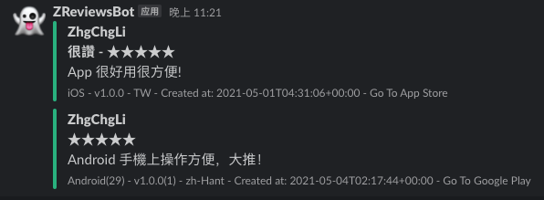
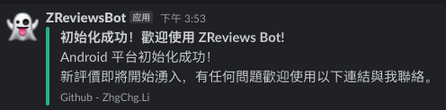

# ZReviewsBot

ZReviewsBot 為免費、開源專案，幫助您的 App 團隊自動追蹤 App Store (iOS) 及 Google Play (Android) 平台上 App 的最新評價，並發送到指定 Slack Channel 方便您即時了解當前 App 狀況。



## 特色

- ✅ 使用更新、更可靠的 API Endpoint 追蹤 iOS App 評價 ([技術細節](https://medium.com/zrealm-ios-dev/appstore-apps-reviews-bot-%E9%82%A3%E4%BA%9B%E4%BA%8B-cb0c68c33994))
- ✅ 支援雙平台評價追蹤 iOS & Android
- ✅ 支援關鍵字通知略過功能 (防洗版廣告騷擾)
- ✅ 客製化設定，隨心所欲
- ✅ 支援使用 Github Action 部署 Schedule 自動機器人

## 安裝及使用

### GEM

1. $ `gem install ZReviewsBot`
2. $ `ZReviewsBot`

### Manually

1. [下載最新版本](https://github.com/ZhgChgLi/ZReviewsBot/releases/latest) 或 Clone 本專案
2. Unzip & $ `cd /ZReviewsBot-X.X.X`
3. Running $ `bundle install` for the first time
4. $ `bundle exec ruby /bin/ZReviewsBot`

## 設定檔配置

1. [下載](https://github.com/ZhgChgLi/ZReviewsBot/blob/main/config.example.yml)或複製專案的 `config.example.yml ` 設定檔範本

2. 更改檔名為 `config.yml`

3. [Android 需要到後台匯出 Google service account key 檔案](https://binx.io/blog/2021/03/07/how-to-create-your-own-google-service-account-key-file/)，並將檔案改成 `android_publisher_key.json` 放在與 `config.yml` 同個目錄下

4. 使用編輯器打開 `config.yml`

5. 依照各參數說明填妥對應資料

   ```YAML
   iOS:
       appID: 'iOS APP ID'
       appleID: 'iOS APP 開發者帳號 (email)'
       password: 'iOS APP 開發者帳號密碼'
       notifyWebHookUrl: 'iOS 最新評價通知的 slack webhook url'
       ignoreKeywords: #要忽略通知的關鍵字，不使用可移除此區塊
           - '博彩'
       iconEmoji: ':dog:' #推送 iOS 通知時的 slack bot 大頭貼
       username: 'ZReview Bot' #推送 iOS 通知時的 slack bot 名稱
   android:
       packageName: 'Android Package Name'
       jsonKeyFileName: 'android_publisher_key.json' # Google service account key 檔案名稱，需與 config.yml 在同個目錄下
       notifyWebHookUrl: 'Android 最新評價通知的 slack webhook url，可與 iOS 相同'
       ignoreKeywords: #要忽略通知的關鍵字，不使用可移除此區塊
           - '博彩'
           - '情色'
       iconEmoji: ':dog:' #推送 android 通知時的 slack bot 大頭貼
       username: 'ZReview Bot' #推送 android 通知時的 slack bot 名稱
   setting:
       lang: "en" # 訊息語系
       developerNotifyWebHookUrl: '接收 debug/爬取失敗/認證失效的 slack webhook url'
   ```

   完成!

## 使用方式

### 執行 iOS App Store 最新評價撈取

`ZReviewsBot -i config.yml`

### 執行 Android Google Play 最新評價撈取

`ZReviewsBot -a config.yml`

### Reset 清除紀錄，重新初始化

`ZReviewsBot -c`

## 執行



- 第一次執行**僅作初始化**，初始化完成後如有比對到新評價則會開始發送訊息
- iOS 第一次執行須完成 [AppStoreConnect 2步驟登入驗證](https://appstoreconnect.apple.com/)，完成驗證後會將登入資訊儲存在環境變數 `FASTLANE_SESSION` 及檔案 `~/.fastlane/spaceship/iOS APP 開發者帳號 (email)/cookie` 中

完成!

## 使用 Github Action 部署 Schedule 自動機器人

**[>> 點我查看](./doc/GithubAction.md)**

# 注意事項

- 登入資訊、帳號密碼、Key 均僅在本地使用，不會經過網路傳輸。
- iOS 評價撈取的 Endpoint 身份驗證，因涉及蘋果全面實行 2 步驟登入；登入資訊最多只能保持 30 天，每 30 天都須重新完成 2步驟驗證登入，此段是直接依賴 fastlane spaceship 實現。

> Unfortunately there is nothing fastlane can do better in this regard, as these are technical limitations on how App Store Connect sessions are handled.
>
> https://docs.fastlane.tools/best-practices/continuous-integration/#important-note-about-session-duration

## 誰在使用？

[](https://www.pinkoi.com/) 

## TODO

- ▢ [英文說明](./doc/en/README.md)


](https://cdn.buymeacoffee.com/buttons/v2/default-yellow.png)
