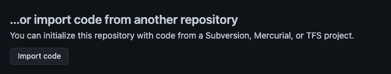
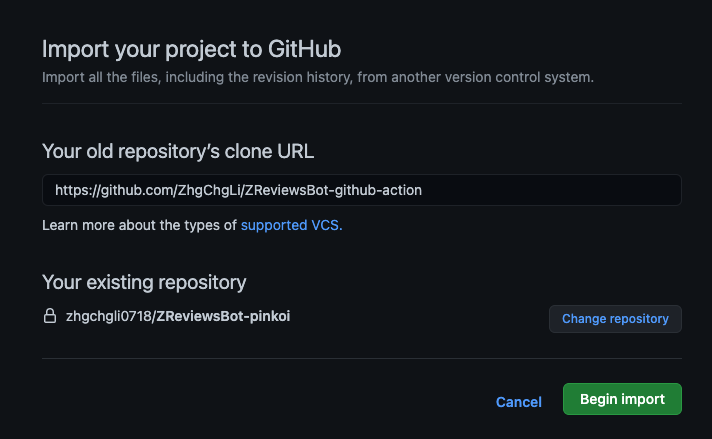
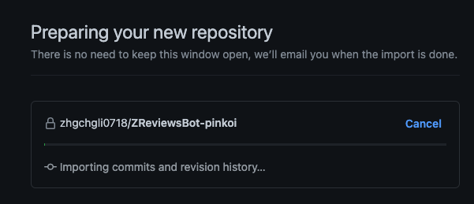
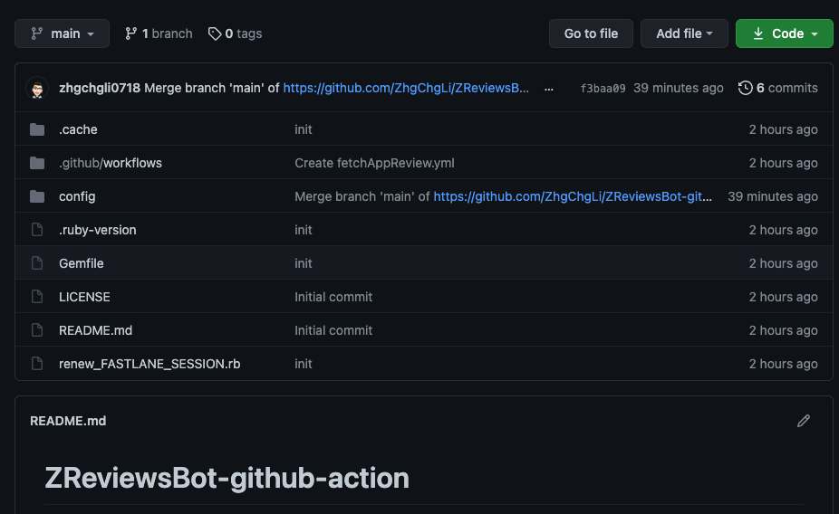

# 使用 Github Action 部署 Schedule 自動機器人

1. 建立一個新 **Private** 專案 For ZReviewsBot

   

   **請注意！因資安考量，請選擇 Private。**

2. 選擇 **Import code**

   

3. `Your old repository's clone URL` 輸入 `https://github.com/ZhgChgLi/ZReviewsBot-github-action`
   

4. 等待 Clone 完成



5. 完成！

6. Clone 下您的專案

7. 使用編輯器[完成設定檔](../README.md) `./config/config.yml`、`android_publisher_key.json`內容。

8. `FASTLANE_SESSION` 檔為 iOS 評價撈取時必備的身份驗證登入資訊，可透過以下方式取得：

   - 使用 `renew_FASTLANE_SESSION.rb` 工具自動完成：

     - Running $ `bundle install` for the first time
     - 執行 $ `bundle exec ruby renew_FASTLANE_SESSION.rb `
     - 完成驗證步驟即可！

   - 手動：

     - 藉由 fastlane 的 [spaceship 指令](https://docs.fastlane.tools/best-practices/continuous-integration/#storing-a-manually-verified-session-using-spaceauth)：

       $ `fastlane spaceauth -u iOS APP 開發者帳號 (email)`

       並將最後內容貼到 `FASTLANE_SESSION` 檔案中
       內容大略如下

       ```
       ---\n- !ruby/object:HTTP::Cookie\n  name: myacinfo\n  value: \n  domain: apple.com\n  for_domain: true\n  path: "/"\n  secure: true\n  httponly: true\n  expires: \n  max_age: \n  created_at: 2021-05-04 22:02:42.351295000 +08:00\n  accessed_at: 2021-05-04 22:05:16.057030000 +08:00\n- !ruby/object:HTTP::Cookie\n  name: \n  value: ///+pO//+\n  domain: idmsa.apple.com\n  for_domain: true\n  path: "/"\n  secure: true\n  httponly: true\n  expires: \n  max_age: 2592000\n  created_at: &1 2021-05-04 22:02:42.351204000 +08:00\n  accessed_at: *1\n- !ruby/object:HTTP::Cookie\n  name: dqsid\n  value: ..\n  domain: appstoreconnect.apple.com\n  for_domain: false\n  path: "/"\n  secure: true\n  httponly: true\n  expires: \n  max_age: 1800\n  created_at: &2 2021-05-04 22:05:17.780772000 +08:00\n  accessed_at: *2\n
       ```

9. 指定自動執行區間

   - 用編輯器打開 `.github/workflows/fetchAppReview.yml`，或直接在 Github -> Actions 上編輯

   - on schedule 部分調整自動執行區間

   ```
   on:
     schedule:
       - cron: "15 */6 * * *" #預設是 每 6 小時的 15 分時執行一次
   ```

   設定可參考[官方說明](https://docs.github.com/en/actions/reference/events-that-trigger-workflows)

10. 都設定完成後，Push 回 Github

11. 等待腳本定時自動執行

12. 完成！